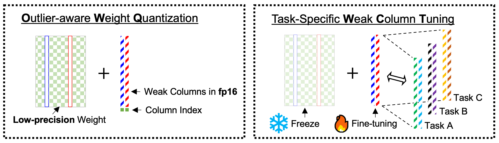

# [AAAI 2024 (Oral)] &nbsp; OWQ: Outlier-Aware Weight Quantization for Efficient Fine-Tuning and Inference of Large Language Models 

<p align="center">
  
</p>
This is the code for the paper [OWQ: Outlier-Aware Weight Quantization for Efficient Fine-Tuning and Inference of Large Language Models](https://arxiv.org/abs/2306.02272). OWQ preserves few weak columns as FP16, while quantizing other weights to 3/4-bits. OWQ achieves substantial quality improvements with only negligible storage and computation overhead, effectively preserving the benefits of low-precision acceleration.

<p align="center">
  <br>
  
</p>

## Updates (2024-01-29)
* Integrated all models (OPT, LLaMA, BLOOM, Falcon) into `main.py` file. You can easily add custom or open-accessible huggingface models to `model_config.json` if you want.
* Support 4bit matrix - FP16 vector product CUDA kernel.
* Support BFloat16.

## Features
* Implementation of the OWQ algorithm: `owq/recon.py`, `main.py`
* 3/4-bit weight quantization of LLMs (OPT, LLaMA-1,2 families and etc ...): `main.py`
* Evaluating the perplexity of quantized models: `main.py`
* Evaluating the zero-shot accuracy of quantized models: `zeroshot.py`
* Supports 3/4-bit packed weight save / load (~1/5, ~1/4 file size of FP16 checkpoint, respectively.)
* Efficient 3/4-bit matrix - FP16 vector product CUDA kernel for OWQ: `owq/kernel`


## Table of contents
* [Install](#install)
* [Usage](#usage)
* [Zero-shot](#zero-shot)
* [3/4-bit CUDA kernels](#34-bit-cuda-kernels)

## Install
We highly recommend to use docker image that supports CUDA. If you use anaconda instead, you need to setup CUDA for kernel use.

0. A) Using Docker
```
docker run -it --gpus all --ipc=host -v {local_storage}:{docker_container_storage} pytorch/pytorch:2.0.0-cuda11.7-cudnn8-devel

# install git
apt update && apt install git -y
```

0. B) Using anaconda instead of docker
```
conda create -n owq python=3.10 -y
conda activate owq
```

1. Clone the OWQ repository
```
git clone https://github.com/xvyaward/owq
cd owq
```
2. Install all the dependencies

```
pip install -r requirements.txt
```
3. Install CUDA kernel (3/4bit_W x FP16_A)
```
cd owq/kernel
python setup_cuda.py install
```
* `torch`: tested on v2.0.0+cu117
* `transformers`: tested on v4.36.2 (or 4.29.2)
* `datasets`: tested on v2.16.1 (or 2.12.0)

Experiments were conducted on a single NVIDIA A100 GPU with 80GB memory. We also confirmed that reconstruction using OWQ works on RTX 3090 GPU (24GB memory) for <= 30B models.

We have tested 3/4-bit CUDA kernel on the NVIDIA A100, A6000 and RTX3090 GPU.

## Usage

### Running OWQ & measuring the perplexity (PPL)

Here we use llama-7b model (huggyllama/llama-7b) as an example. You can replace the model argument `llama-7b` among `llama-13b`, `llama-30b`, and `llama-65b` or other model families (e.g. `meta-llama/Llama-2-7b-hf`, `facebook/opt-6.7b`, `lmsys/vicuna-33b-v1.3`, etc ...).

* OWQ using 3.01-bit (3-bit quantization + few FP16 weight columns)
```
python main.py huggyllama/llama-7b c4 --wbits 3 --target_bit 3.01
```
* OWQ using 4.01-bit (4-bit quantization + few FP16 weight columns)
```
python main.py huggyllama/llama-7b c4 --wbits 4 --target_bit 4.01
```

Below are the example for the other options (FP16, RTN, GPTQ). 
```
# Measuring the ppl of the full precision (FP16) model
python main.py huggyllama/llama-7b c4 --wbits 16

# 4-bit Round-to-Nearest (RTN) quantization
python main.py huggyllama/llama-7b c4 --wbits 4 --nearest

# GPTQ with 3-bit quantization
python main.py huggyllama/llama-7b c4 --wbits 3 --tuning minmax
```

### Zero-shot
Here we give an example of measuring zero-shot accuracy on `hellaswag` tasks using llama-7b model.
You need to generate quantized model checkpoint before measuring the zero-shot accuracy.  
```
# making checkpoint file of OWQ reconstruction
python main.py huggyllama/llama-7b c4 --wbits 3 --target_bit 3.01 --no-eval --save llama-7b_3_01.pth --packing

# measuring zero-shot accuracy (using single-gpu)
CUDA_VISIBLE_DEVICES=0 python zeroshot.py --model hf-causal-owq --model_args pretrained=huggyllama/llama-7b,load=llama-7b_3_01.pth --batch_size 4 --tasks hellaswag --no_cache
# multi-gpu
CUDA_VISIBLE_DEVICES=0,1 python zeroshot.py --model hf-causal-owq --model_args pretrained=huggyllama/llama-7b,load=llama-7b_3_01.pth,use_accelerate=True --batch_size 4 --tasks hellaswag --no_cache
```

### Easy OPT OWQ + Measuring PPL, Zeroshot sample
```
bash scripts/opt_end_to_end_evaluation.sh 0 opt-1.3b
```

## Demo
Please refer to the README in the `demo` directory.

## 3/4-bit CUDA Kernels 

### Benchmark kernel performance
```
# Benchmark performance for the matrix-vector multiplication
cd owq/kernel/
python test_kernel.py
```

### Benchmark language generation with 3/4-bit packed model (opt, llama, etc...)
```
# Example of OPT-66b language generation (single token)

# Save compressed model
python main.py facebook/opt-66b c4 --wbits 3 --target_bit 3.01 --no-eval --save opt-66b_3_01.pth --packing

# Benchmark generating a 128 token sequence with the saved model
CUDA_VISIBLE_DEVICE=0 python main.py facebook/opt-66b c4 --load opt-66b_3_01.pth --benchmark 128 --faster

# Benchmark FP16 baseline, note that the model will be split across all listed GPUs
CUDA_VISIBLE_DEVICES=0,1,2 python main.py facebook/opt-66b c4 --benchmark 128
```

Please note that our 3/4-bit kernels are currently only optimized for A100 or A6000 GPUs and may thus yield suboptimal performance on smaller models or on other GPUs.


## Reference

[GPTQ: Accurate Post-training Compression for Generative Pretrained Transformers](https://arxiv.org/abs/2210.17323)

This code is based on [GPTQ](https://github.com/IST-DASLab/gptq).

Our zero-shot experiment codes are based on [EleutherAI/lm-evaluation-harness](https://github.com/EleutherAI/lm-evaluation-harness).

Thanks to Meta AI for releasing powerful LLM [OPT](https://arxiv.org/abs/2205.01068) and [LLaMA](https://arxiv.org/abs/2302.13971).
## Cite

If you find our code or OWQ useful for your research, please consider citing:

```
@article{lee2023owq,
  title={OWQ: Lessons learned from activation outliers for weight quantization in large language models},
  author={Lee, Changhun and Jin, Jungyu and Kim, Taesu and Kim, Hyungjun and Park, Eunhyeok},
  journal={arXiv preprint arXiv:2306.02272},
  year={2023}
}
```
